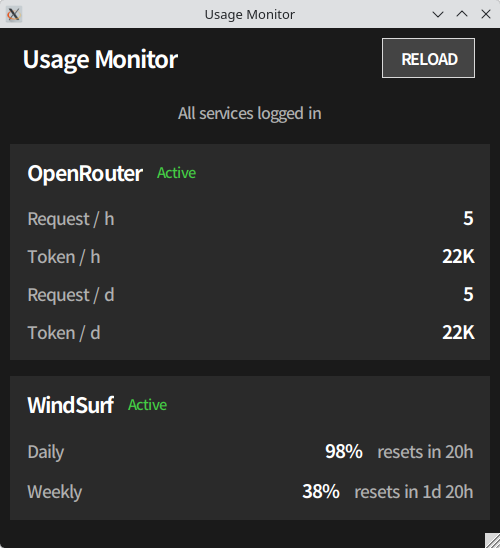

# Simple Usage Monitor

Windsurf / OpenRouter / Groq / Cerebras / SambaNova の使用量をモニタリングする Tkinter + Playwright アプリ。



## 必要要件

- Python 3.12+
- [uv](https://astral.sh/uv/)

## 起動

```bash
chmod +x run.sh

# 通常起動（バックグラウンド）
./run.sh

# デバッグモード（ターミナルにログ表示）
./run.sh --debug
```

`run.sh` が venv 作成、依存インストール（Playwright, PyYAML）、Chromium セットアップ、アプリ起動を自動で行います。
二重起動防止機能あり。起動時に既存プロセスを自動終了してから起動します。

## 使い方

1. **サービスパネルをクリック**（WindSurf / OpenRouter / Groq / Cerebras / SambaNova）→ ログイン用ブラウザが開く
2. Google 等でログイン。MFA（多要素認証）対応（最大5分待機）
3. ログイン検出後、ブラウザが自動的に閉じる
4. バックグラウンドでヘッドレスにデータ取得
5. 設定した間隔で自動更新（デフォルト: 30分）
6. **RELOAD** ボタンで手動更新
7. **「Usage Monitor」タイトルをクリック**で Settings を開く

セッション Cookie は `sessions/` に保存され、再起動後も再利用されます。
ウィンドウ・設定ダイアログのサイズは閉じたときに自動保存されます。

## 設定

`config.yaml` は初回起動時に自動生成されます（`.gitignore` 対象）。

```yaml
headless: false
refresh_interval: 30      # 分
window_size: 500x520      # メインウィンドウサイズ（終了時に自動保存）
settings_size: 504x359    # 設定ダイアログサイズ（閉じた時に自動保存）
services:
  windsurf:
    enabled: true
    url: https://windsurf.com/subscription/usage
  openrouter:
    enabled: true
    url: https://openrouter.ai/activity
  groq:
    enabled: true
    url: https://console.groq.com/dashboard/usage?tab=activity
  cerebras:
    enabled: true
    url: https://cloud.cerebras.ai/
  sambanova:
    enabled: true
    url: https://cloud.sambanova.ai/plans/usage
thresholds:
  windsurf_daily: 30       # 残量%がこの値以下でオレンジ表示
  windsurf_weekly: 20
```

## プロジェクト構成

```
├── main.py           # Tkinter GUI アプリ
├── config.yaml       # 設定ファイル（自動生成・gitignore対象）
├── run.sh            # 起動スクリプト (Linux)
└── scrapers/
    ├── __init__.py
    ├── base.py       # BaseScraper（Playwright セッション管理）
    ├── windsurf.py   # Windsurf スクレイパー
    ├── openrouter.py # OpenRouter スクレイパー
    ├── groq.py       # Groq スクレイパー
    ├── cerebras.py   # Cerebras スクレイパー
    └── sambanova.py  # SambaNova スクレイパー
```

## トラブルシューティング

- **未ログイン**: サービスパネルをクリックしてログインブラウザを開く
- **セッション切れ**: 再度パネルをクリックして再ログイン
- **MFA タイムアウト**: ログイン完了まで最大5分あります（MFA含む）
- **ブラウザが閉じない**: GUI ウィンドウを閉じれば自動クリーンアップ
- **Google ログインブロック**: 試行回数が多すぎた場合、1〜2時間待つ
